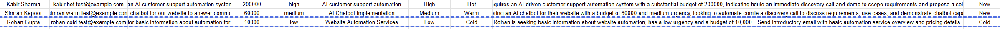

# AI Customer Support Lead Intake & Qualification Automation

An AI-powered lead intake, qualification, deduplication, and intelligent routing automation built with **Make.com, OpenAI, Google Sheets, Gmail, Webhooks, and JSON**.

The system automatically captures customer enquiries, checks for duplicate leads, uses AI to qualify new enquiries, stores structured lead information, and routes leads based on priority and lead quality.

---

## Project Overview

Businesses receive customer enquiries through forms, websites, chat systems, and other channels.

Manually processing every enquiry can result in:

* Slow response times
* Duplicate lead records
* Inconsistent lead qualification
* Missed high-priority enquiries
* Repetitive manual work
* Poor visibility into incoming leads

This project demonstrates how **AI and no-code automation** can transform this process into a structured and automated workflow.

---

## Business Problem

A typical customer enquiry process may require an employee to:

1. Receive the enquiry
2. Check whether the customer already exists
3. Understand the customer's requirement
4. Assess urgency
5. Determine lead quality
6. Decide the appropriate next action
7. Record the information
8. Notify the relevant team

Performing these steps manually for every enquiry is time-consuming and can lead to inconsistent decisions.

### Goal

Build an automation that can handle these steps automatically while maintaining structured data and clear business rules.

---

## Solution

The automation follows this process:

**Customer Enquiry → Webhook → Duplicate Check → AI Qualification → Structured JSON → Google Sheets → Intelligent Routing**

New enquiries are analyzed by AI and classified according to:

* Category
* Priority
* Lead Temperature
* Lead Score
* Recommended Action
* AI Summary

The system then routes the lead according to predefined business rules.

---

## Workflow Architecture

```text
Customer Enquiry
       ↓
Webhook
       ↓
Google Sheets — Search Rows
       ↓
Duplicate Check
       ↓
NEW LEAD?
       ↓
OpenAI — AI Lead Qualification
       ↓
JSON — Parse Structured AI Output
       ↓
Google Sheets — Add Row
       ↓
Router
   ┌───────────────┼────────────────┐
   ↓               ↓                ↓
Hot + High       Warm          Cold / Other
   ↓               ↓                ↓
Gmail Alert     Gmail Follow-up   Google Sheets
```

---

## AI Lead Qualification

OpenAI evaluates each new lead using the information provided by the customer.

### AI-Generated Fields

| Field              | Purpose                                        |
| ------------------ | ---------------------------------------------- |
| Category           | Identifies the type of requirement             |
| Priority           | Classifies the enquiry as Low, Medium, or High |
| Lead Temperature   | Classifies the lead as Cold, Warm, or Hot      |
| Lead Score         | Generates a score from 0–100                   |
| Recommended Action | Suggests the appropriate next business action  |
| Summary            | Provides a concise summary of the enquiry      |

The AI is instructed to use **only the information provided by the customer** and avoid inventing facts.

---

## Duplicate Prevention

Duplicate prevention happens **before AI processing**.

The workflow searches Google Sheets using the customer's **email address**.

### Existing Lead

```text
Search Rows
     ↓
Email already exists
     ↓
Duplicate Filter
     ↓
Workflow stops
```

### New Lead

```text
Search Rows
     ↓
Email does not exist
     ↓
Duplicate Filter passes
     ↓
AI qualification continues
```

Using email as the primary identifier prevents the same lead from unnecessarily entering the qualification and lead-storage process again.

---

## Intelligent Lead Routing

After AI qualification, the Router applies predefined business rules.

### Hot + High Priority

High-priority hot leads trigger an immediate Gmail notification.

**Action:** Contact the lead as soon as possible.

### Warm Leads

Warm leads trigger an automated follow-up email.

**Action:** Review the enquiry and follow up.

### Cold / Other Leads

Cold and unmatched leads are handled through the fallback route and updated in Google Sheets.

**Action:** Store and monitor without sending an immediate alert.

This routing approach helps ensure that higher-priority leads receive faster attention while reducing unnecessary notifications.

---

# Project Screenshots

## 1. Complete Workflow


Shows the complete automation architecture from webhook intake through AI processing, data storage, and intelligent routing.

---

## 2. OpenAI Prompt & Configuration

### AI Prompt


Shows the AI qualification prompt and customer data mapping used to analyze incoming enquiries.

### AI Configuration


Shows the relevant OpenAI configuration and structured JSON output setup.

---

## 3. Duplicate Prevention


Shows the duplicate detection logic based on the customer's email address.

---

## 4. Intelligent Routing


Shows the three business-rule-based routing paths for Hot, Warm, and Cold/Other leads.

---

## 5. Test Results



Shows successful end-to-end testing of the automation across different lead scenarios.

---

# Testing

The workflow was tested using multiple lead scenarios covering Hot, Warm, Cold, and Duplicate cases.

### Hot Lead — Kabir Sharma

* **Budget:** ₹200,000
* **Urgency:** High
* **AI Lead Quality:** Hot
* **AI Priority:** High

**Result:** Gmail Hot Lead Alert successfully triggered.

---

### Warm Lead — Simran Kapoor

* **Budget:** ₹60,000
* **Urgency:** Medium
* **AI Lead Quality:** Warm

**Result:** Automated Warm Lead follow-up email successfully triggered.

---

### Cold Lead — Rohan Gupta

* **Budget:** ₹10,000
* **Urgency:** Low
* **AI Lead Quality:** Cold

**Result:** Lead was handled through the fallback Google Sheets route without triggering a Gmail alert.

---

### Duplicate Lead

An existing email address was submitted again.

**Result:** The duplicate filter blocked the lead from continuing to AI processing and new-row creation.

---

# Tools & Technologies

* **Make.com** — Workflow automation platform
* **OpenAI** — AI-powered lead qualification
* **Google Sheets** — Lead data storage and duplicate checking
* **Gmail** — Automated notifications and follow-ups
* **Webhooks** — Automated data intake
* **JSON** — Structured AI output
* **Filters** — Business-rule implementation
* **Router** — Intelligent workflow branching

---

# Business Value

This automation can help businesses:

* Reduce repetitive manual lead processing
* Respond faster to important enquiries
* Prevent duplicate lead records
* Standardize lead qualification
* Automatically prioritize customer enquiries
* Reduce unnecessary notifications
* Maintain organized lead data
* Improve operational efficiency
* Create consistent and scalable business processes

---

# My Contribution

I designed and implemented the complete automation workflow, including:

* Business process mapping
* Workflow architecture
* Webhook-based customer enquiry intake
* Duplicate detection logic
* AI prompt design
* AI lead classification
* Structured JSON output
* Data mapping
* Google Sheets integration
* Conditional filtering
* Intelligent routing
* Gmail automation
* Fallback route handling
* End-to-end testing
* Troubleshooting and workflow optimization

---

# Skills Demonstrated

## AI & Automation

* AI workflow design
* Prompt engineering
* AI classification
* No-code automation
* Business process automation

## Technical

* Make.com
* Webhooks
* JSON
* API and integration concepts
* Data mapping
* Conditional logic
* Routers
* Structured data processing

## Business & Operations

* Process optimization
* Lead qualification
* Business-rule design
* Operational efficiency
* Automation opportunity identification
* Workflow design
* Requirement analysis

---

# Potential Business Applications

The same automation architecture can be adapted for:

* Sales lead qualification
* Customer support enquiries
* Website contact forms
* Service businesses
* Marketing agencies
* SaaS companies
* E-commerce support
* Appointment enquiries
* B2B lead intake
* Internal request management

---

# Future Improvements

Potential future versions could include:

* CRM integration
* Slack or Microsoft Teams notifications
* Automated lead assignment
* Lead scoring dashboards
* Personalized AI-generated email responses
* AI-generated response drafts
* Automated follow-up reminders
* Multi-channel lead intake
* Advanced duplicate detection using multiple identifiers
* Analytics and reporting
* CRM-based lead lifecycle management

---

# Project Outcome

This project demonstrates how **AI + no-code automation + business logic** can transform a manual customer enquiry process into an automated operational workflow.

The completed system handles:

**Intake → Deduplication → AI Qualification → Data Storage → Intelligent Routing → Notification**

The workflow was successfully tested across **Hot, Warm, Cold, and Duplicate** lead scenarios.

---

## Project Type

**AI Business Automation / No-Code Workflow Automation**

## Primary Platform

**Make.com**

## Status

**Completed & Tested**

---

## Author

**Muskan Arora**

AI Automation & Business Operations Specialist
